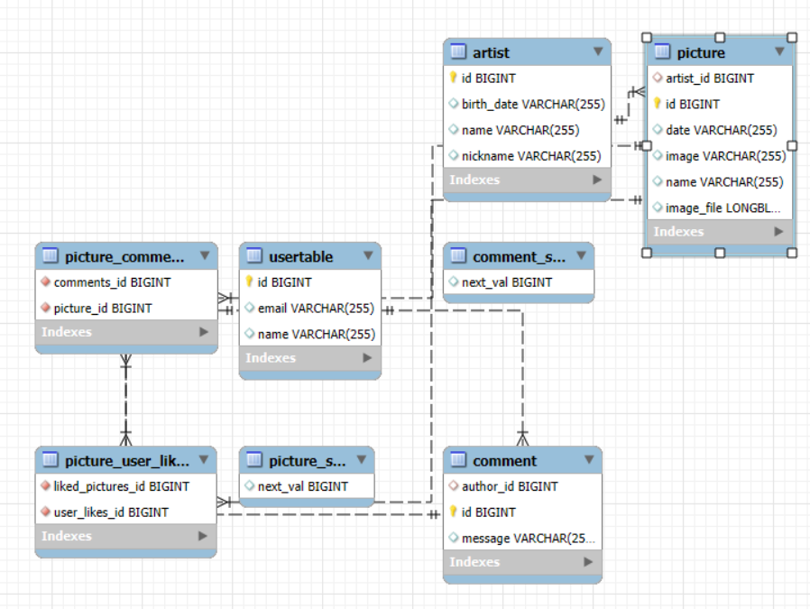

# 🎨 Museo del Trapo - Portal Web Oficial

> _“Detrás de cada pincelada, una historia. Detrás del trapo, un arte que respira.”_

Bienvenidos al **Museo del Trapo**, un espacio cultural que recoge la obra de artistas emergentes y consagrados en el arte pictórico. Desde lienzos modernos hasta técnicas clásicas, este sitio web permite descubrir exposiciones únicas, adquirir obras originales y formar parte de una comunidad que vibra con el arte.

---

## 🖼️ ¿Qué puedes hacer en este museo digital?

🔍 **Explorar exposiciones de arte**  
🖌️ **Descubrir artistas y sus obras** 
🧾 **Comentar y dar me gusta en tus obras preferidas**
👤 **Crear una cuenta de visitante o acceder como administrador**

---

## 🧶 Arquitectura del Proyecto

El sistema se basa en una arquitectura REST bien estructurada. Las entidades clave del sistema son:

| Entidad        | Descripción                                                                 |
|----------------|-----------------------------------------------------------------------------|
| `User`         | Visitantes o administradores del museo digital.                             |
| `Artist`       | Creador o autora de las obras, con su propia ficha informativa.             |
| `Picture`      | Cuadros únicos que pueden visualizarse.                                     |
| `Comment`      | Deja tu comentario en los cuadros que más te gusten.                        |

### 🕸️ Relaciones entre entidades

- Un `User` puede:
  - Comentar varios `Picture`
  - Dar like a varios `Picture`
- Un `Artist` puede agrupar ninguna o muchas `Picture`
- Cada `Picture` pertenece a un `Artist`
- Un `Picture` puede ser comentado por múltiples `User`
- Un `Picture` puede tener me gusta de varios `User`

---

## 🛡️ Gestión de Acceso

| Rol              | Permisos                                                                  |
|------------------|--------------------------------------------------------------------------|
| `Administrador`  | Gestión total de usuarios, obras, artistas, comentarios y likes.         |
| `Usuario`        | Visualizar cuadros, comentarlos y dar like.                              |

---

## 🌍 Un paseo visual por el museo

📸 Los artistas y cuadros incluyen imágenes de alta calidad para enriquecer la experiencia virtual.  
🖼️ 

---

## 🛠️ Herramientas y Tecnologías

- **Spring Boot** – Backend robusto con APIs REST.
- **HTML/CSS** – Interfaz inspirada en galerías de arte contemporáneo.
- **MySQL** – Base de datos relacional.
- **DTOs y Mappers** – Flujo limpio de datos entre cliente y servidor.

---

## 👩‍🎨 Equipo de Desarrollo

Desarrollado por el grupo **15**:

👨‍💻 **Alejandro Sanchez Díaz**  
Encargado de:
  - Protección contra XSS, CSRF, LFI...
  - Registro/login 
  - Implementación de texto enriquecido
  - Control de roles
🔗 [@asaanchezz10](https://github.com/asaanchezz10)

#### Listado de los 5 commits más significativos

1. **[Commit: b43580e -> Proteccion XSS](https://github.com/DWS-2025/project-grupo-15/commit/b43580e876670c36b3ed46233a5526cffb65e0f5)**  
   Descripción: Proteccion XSS con sanitizacion en el servicio y cambios menores en algunos headers.

2. **[Commit: 1f87441 -> Proteccion LFI](https://github.com/DWS-2025/project-grupo-15/commit/1f87441c212ce8d41b9961cfd03c465daa03c2b0)**  
   Descripción: Subida de ficheros en disco y seguridad contra ataques LFI.

3. **[Commit: 4872cf1 -> Control de roles](https://github.com/DWS-2025/project-grupo-15/commit/4872cf1e4b7e09eb5340b493adfbe18eca61b2c5)**
   Descripción: Mejoras y configuración de los roles dentro de la aplicación.

4. **[Commit: 80ddd08 -> Controladores de login y para usuarios](https://github.com/DWS-2025/project-grupo-15/commit/80ddd0805b3216b40d7efc21a0e68c0a87ab8a4b)**  
   Descripción: Implementación de controladores para el login y para la gestion de usuarios.

5. **[Commit: c74063a -> Texto enriquecido en comentarios](https://github.com/DWS-2025/project-grupo-15/commit/c74063a7bbb0acc0297896f8bdbfc1b76d788bc1)**  
   Descripción: Implementación de texto enriquecido en la parte de comentarios de la aplicación.

👨‍🎨 **Samuel López Cabezudo**  
Responsable de:
- Controladores Rest
- Funcionamiento del servicio de seguridad
- Pruebas de detección de vulnerabilidades
- Otros arreglos menores
🔗 [@P3rseo](https://github.com/P3rseo)

#### Listado de los 5 commits más significativos

1. **[Commit: 267ce2e -> Configuración de seguridad de la API rest](https://github.com/DWS-2025/project-grupo-15/commit/267ce2e1845b5118a44262a8ac04aa05a51ddbf4)**  
   Descripción: Implementación de la configuracion de seguridad de la aplicación.

2. **[Commit: 376b6cc -> Nuevas rutas API](https://github.com/DWS-2025/project-grupo-15/commit/376b6cc7a40318eb306286313db64dfec6b50784)**  
   Descripción: Implementación de las nuevas rutas dentro de la aplicación.

3. **[Commit: efec7c2 -> Picture REST](https://github.com/DWS-2025/project-grupo-15/commit/efec7c2e56a3a1fa71dbbb46d4d56c0a0d211707)**  
   Descripción: Modificaciones menores para el correcto funcionamiento de la aplicación.
---

## 🔗 Rutas Principales

- `/index` – Página principal de acceso a cuadros, artistas y usuarios
- `/artists` – Lista de artistas con sus fichas y obras
- `/pictures` – Catálogo de cuadros disponibles
- `/register` – Registro de nuevos usuarios
- `/api/**` – Endpoints REST para integraciones y pruebas

---

## 🌟 Características Destacadas

🎨 Galería virtual con navegación fluida  
🧵 Diseño elegante que combina lo clásico y lo moderno  
📦 Imágenes de obras almacenadas y gestionadas eficientemente  
🔐 Roles y permisos para un acceso controlado (todavía no)

---

## 🗂️ ¿Qué viene después?

- ✅ Paginación, filtros y búsquedas por artista o técnica
- 🚧 Gestión de visitas guiadas y eventos especiales
- 📊 Panel con métricas para artistas y administradores
- 🌐 Versión multilingüe para visitantes internacionales

---

> Hecho con arte, propósito y código.  
> _Museo del Trapo – Donde la pintura cobra vida._
